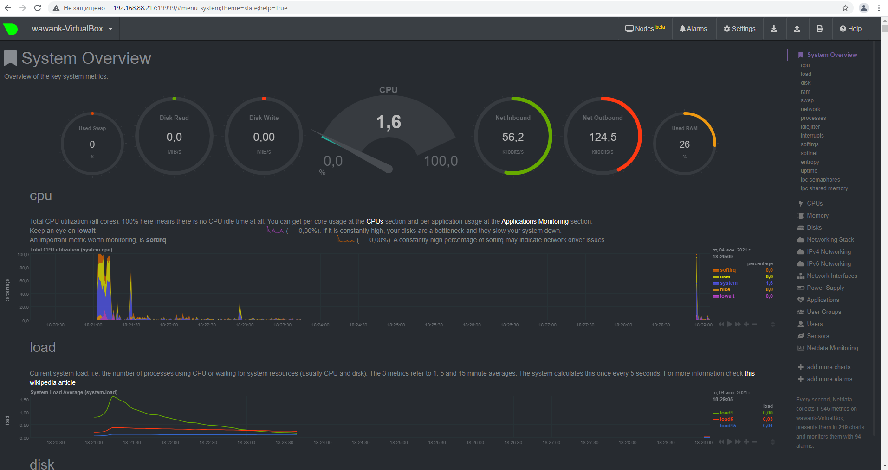

# Домашнее задание к занятию "3.4. Операционные системы, лекция 2"

1. На лекции мы познакомились с [node_exporter](https://github.com/prometheus/node_exporter/releases). В демонстрации его исполняемый файл запускался в background. Этого достаточно для демо, но не для настоящей production-системы, где процессы должны находиться под внешним управлением. Используя знания из лекции по systemd, создайте самостоятельно простой [unit-файл](https://www.freedesktop.org/software/systemd/man/systemd.service.html) для node_exporter:

    * поместите его в автозагрузку,
    * предусмотрите возможность добавления опций к запускаемому процессу через внешний файл (посмотрите, например, на `systemctl cat cron`),
    * удостоверьтесь, что с помощью systemctl процесс корректно стартует, завершается, а после перезагрузки автоматически поднимается.
   > Ответ:
   > ```bash
   > $ wget https://github.com/prometheus/node_exporter/releases/download/v1.1.2/node_exporter-1.1.2.linux-amd64.tar.gz
   > $ tar xvfz node_exporter-1.1.2.linux-amd64.tar.gz
   > $ sudo cp ./node_exporter-1.1.2.linux-amd64/node_exporter /usr/sbin/
   > $ ls /usr/sbin/* | grep node_
   > /usr/sbin/node_exporter
   > $ sudo touch /lib/systemd/system/node_exporter.service
   > $ sudo ln -s /lib/systemd/system/node_exporter.service /etc/systemd/system/node_exporter.service
   > $ ll /etc/systemd/system/node_exporter.service
   > lrwxrwxrwx 1 root root 41 июн  4 15:48 node_exporter.service -> /lib/systemd/system/node_exporter.service
   > $ sudo nano /lib/systemd/system/node_exporter.service
   > $ cat /etc/systemd/system/node_exporter.service
   > [Unit]
   > Description=Prometheus Node Exporter
   > After=remote-fs.target nss-user-lookup.target
   >
   > [Service]
   > EnvironmentFile=/usr/sbin/node_exporter.conf
   > ExecStart=/usr/sbin/node_exporter $EXTRA_OPTS
   > 
   > [Install]
   > WantedBy=multi-user.target
   > $ sudo touch /usr/sbin/node_exporter.conf
   > $ sudo nano /usr/sbin/node_exporter.conf
   > $ cat /usr/sbin/node_exporter.conf
   > EXTRA_OPTS=""
   > $ sudo systemctl daemon-reload
   > $ systemctl cat node_exporter.service
   > # /lib/systemd/system/node_exporter.service
   > [Unit]
   > Description=Prometheus Node Exporter
   > After=remote-fs.target nss-user-lookup.target
   > 
   > [Service]
   > EnvironmentFile=/usr/sbin/node_exporter.conf
   > ExecStart=/usr/sbin/node_exporter $EXTRA_OPTS
   > 
   > [Install]
   > WantedBy=multi-user.target
   > $ sudo systemctl enable node_exporter
   > Created symlink /etc/systemd/system/multi-user.target.wants/node_exporter.service → /lib/systemd/system/node_exporter.service.
   > $ sudo systemctl start node_exporter
   > $ curl http://localhost:9100/metrics | grep 'node_cpu_seconds_total{cpu="0",mode="idle"}'
   >   % Total    % Received % Xferd  Average Speed   Time    Time     Time  Current
   >                                  Dload  Upload   Total   Spent    Left  Speed
   >   0     0    0     0    0     0      0      0 --:--:-- --:--:-- --:--:--     0node_cpu_seconds_total{cpu="0",mode="idle"} 6954.16
   > 100 58995    0 58995    0     0  4801k      0 --:--:-- --:--:-- --:--:-- 4801k
   > $ sudo systemctl stop node_exporter
   > $ journalctl -u node_exporter.service
   > июн 04 16:56:00 wawank-VirtualBox systemd[1]: Started Prometheus Node Exporter.
   > июн 04 16:56:00 wawank-VirtualBox node_exporter[2959]: level=info ts=2021-06-04T12:56:00.048Z caller=node_exporter.go:178 msg="Starting node_exporter" versi>
   > ...
   > июн 04 16:56:27 wawank-VirtualBox systemd[1]: Stopping Prometheus Node Exporter...
   > июн 04 16:56:27 wawank-VirtualBox systemd[1]: node_exporter.service: Succeeded.
   > июн 04 16:56:27 wawank-VirtualBox systemd[1]: Stopped Prometheus Node Exporter.
   > ```
1. Ознакомьтесь с опциями node_exporter и выводом `/metrics` по-умолчанию. Приведите несколько опций, которые вы бы выбрали для базового мониторинга хоста по CPU, памяти, диску и сети.
   > Ответ:
   > Я бы отключил все дефолтные коллекторы, включив только необходимые в файл /usr/sbin/node_exporter.conf, который передает параметры сервису node_exporter при старте (см. предыдущее задание).
   > ```bash
   > $ sudo nano /usr/sbin/node_exporter.conf
   > $ cat /usr/sbin/node_exporter.conf
   > EXTRA_OPTS="--collector.disable-defaults --collector.cpu --collector.cpufreq --collector.meminfo --collector.diskstats --collector.netdev --collector.netstat"
   > $ sudo systemctl restart node_exporter
   > ```
1. Установите в свою виртуальную машину [Netdata](https://github.com/netdata/netdata). Воспользуйтесь [готовыми пакетами](https://packagecloud.io/netdata/netdata/install) для установки (`sudo apt install -y netdata`). После успешной установки:
    * в конфигурационном файле `/etc/netdata/netdata.conf` в секции [web] замените значение с localhost на `bind to = 0.0.0.0`,
    * добавьте в Vagrantfile проброс порта Netdata на свой локальный компьютер и сделайте `vagrant reload`:

    ```bash
    config.vm.network "forwarded_port", guest: 19999, host: 19999
    ```

    После успешной перезагрузки в браузере *на своем ПК* (не в виртуальной машине) вы должны суметь зайти на `localhost:19999`. Ознакомьтесь с метриками, которые по умолчанию собираются Netdata и с комментариями, которые даны к этим метрикам.
   > Ответ: Т.к. я не могу использовать vagrant из-за Касперского на корпоративном ноутбуке - привожу скрин GUI работающей netdata по ip моей ВМ VirtualBox, а не через localhost.
   > ```bash
   > $ sudo nano /etc/netdata/netdata.conf
   > $ cat /etc/netdata/netdata.conf | grep bind
   >         bind socket to IP = 0.0.0.0
   > $ systemctl start netdata.service
   > ==== AUTHENTICATING FOR org.freedesktop.systemd1.manage-units ===
   > Чтобы запустить «netdata.service», необходимо пройти аутентификацию.
   > Authenticating as: w-awank,,, (w-awank)
   > Password:
   > ==== AUTHENTICATION COMPLETE ===
   > 
   > ```
   > 
   > Скрин GUI Netdata: 

1. Можно ли по выводу `dmesg` понять, осознает ли ОС, что загружена не на настоящем оборудовании, а на системе виртуализации?
   > Ответ: Да, ОС осознает, что загружена на системе виртуализации:
   > ```bash
   > $ dmesg | grep virtual
   > [    0.002305] CPU MTRRs all blank - virtualized system.
   > [    0.039705] Booting paravirtualized kernel on KVM
   > [    2.976867] systemd[1]: Detected virtualization oracle.
   > ```
1. Как настроен sysctl `fs.nr_open` на системе по-умолчанию? Узнайте, что означает этот параметр. Какой другой существующий лимит не позволит достичь такого числа (`ulimit --help`)?
   > Ответ: этот параметр ядра показывает максимально возможное число открытых файлов в системе (максимальное количество дескрипторов открытых файлов - 1048576). Но другой лимит не позволит достичь такого большого числа: команда `ulimit -n` отображает ограничение уже максимум в 1024 открытых файловых дескриптора:  
   > ```bash
   > $ sysctl -a 2>/dev/null | grep ^fs\.nr_open
   > fs.nr_open = 1048576
   > $ ulimit -n
   > 1024  
   > ```
1. Запустите любой долгоживущий процесс (не `ls`, который отработает мгновенно, а, например, `sleep 1h`) в отдельном неймспейсе процессов; покажите, что ваш процесс работает под PID 1 через `nsenter`. Для простоты работайте в данном задании под root (`sudo -i`). Под обычным пользователем требуются дополнительные опции (`--map-root-user`) и т.д.
   > Ответ:
   > ```bash
   > $ sudo -i
   > # unshare -f --pid --mount-proc /bin/sleep 1h
   > 
   > ### из другой сессии ssh:
   > $ sudo -i
   > # ps a | grep /bin/sleep
   > 2329 pts/0    S+     0:00 unshare -f --pid --mount-proc /bin/sleep 1h
   > 2330 pts/0    S+     0:00 /bin/sleep 1h
   > 2375 pts/1    S+     0:00 grep --color=auto /bin/sleep
   > # nsenter --target 2330 --pid --mount
   > # ps aux
   > USER         PID %CPU %MEM    VSZ   RSS TTY      STAT START   TIME COMMAND
   > root           1  0.0  0.0  16716   524 pts/0    S+   23:15   0:00 /bin/sleep 1h
   > root           2  0.0  0.2  19236  4924 pts/1    S    23:26   0:00 -bash
   > root          11  0.0  0.1  20164  3476 pts/1    R+   23:27   0:00 ps aux
   > ```
1. Найдите информацию о том, что такое `:(){ :|:& };:`. Запустите эту команду в своей виртуальной машине Vagrant с Ubuntu 20.04 (**это важно, поведение в других ОС не проверялось**). Некоторое время все будет "плохо", после чего (минуты) – ОС должна стабилизироваться. Вызов `dmesg` расскажет, какой механизм помог автоматической стабилизации. Как настроен этот механизм по-умолчанию, и как изменить число процессов, которое можно создать в сессии?
   > Ответ: Данная команда является логической fork-бомбой. Она оперирует определением функции с именем ‘:‘, которая рекурсивно вызывает сама себя дважды: один раз на переднем плане и один раз в фоне. Она продолжает своё выполнение снова и снова, создавая новые процессы, пока система не зависнет. Я не смог дождаться стабилизации - моя система упала, и пришлось ее жестко ребутать.
   > Думаю максимальное количество процессов по умолчанию можно посмотреть командой `ulimit -u`. 
   >```bash
   > $ ulimit -u
   > 7717
   > ### увеличить в текущей сессии можно из под root:
   > # ulimit -u 8000
   > # ulimit -u
   > 8000
   > ### если необходимо сохранить при перезагрузке этот параметр, то нужно корректировать файл /etc/security/limits.conf
   >```
