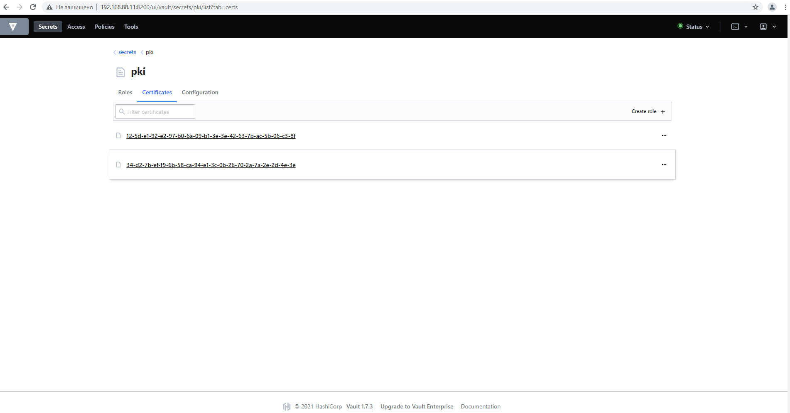
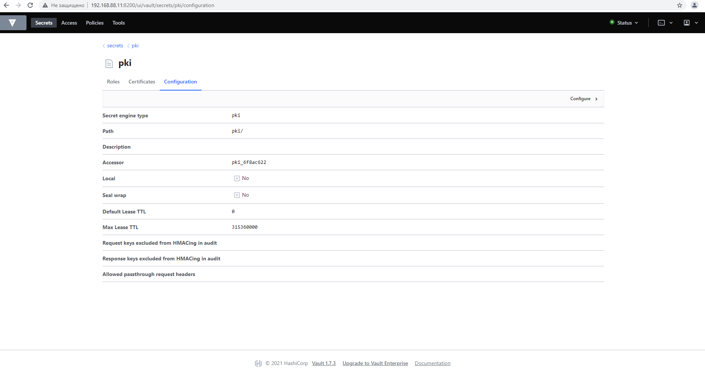
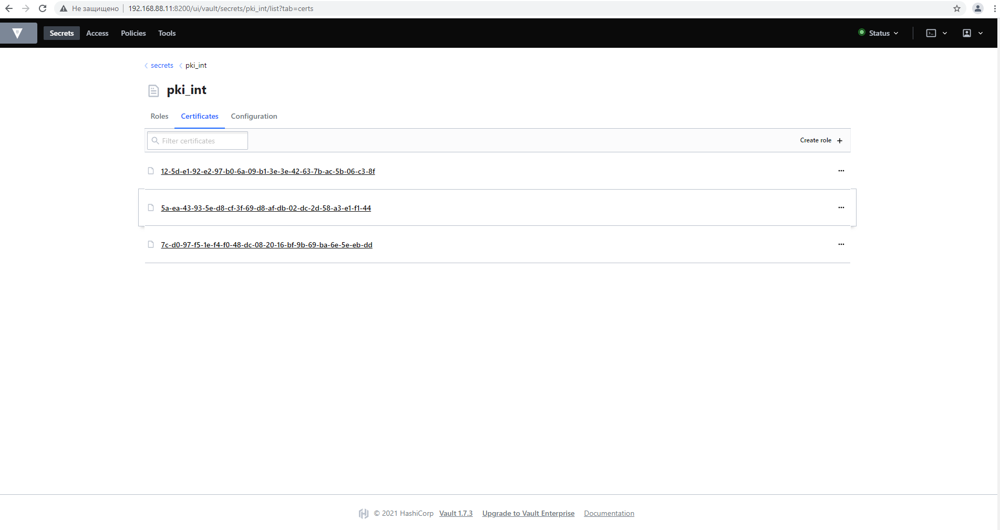
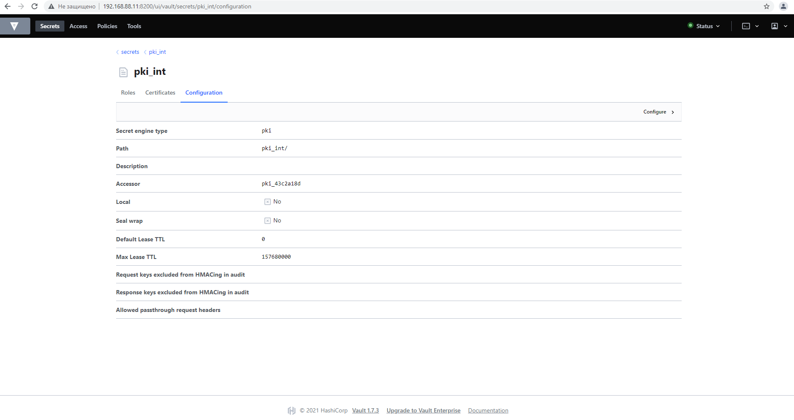
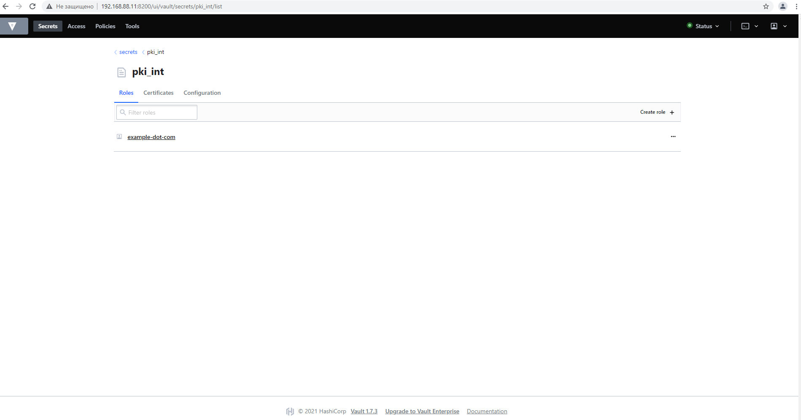
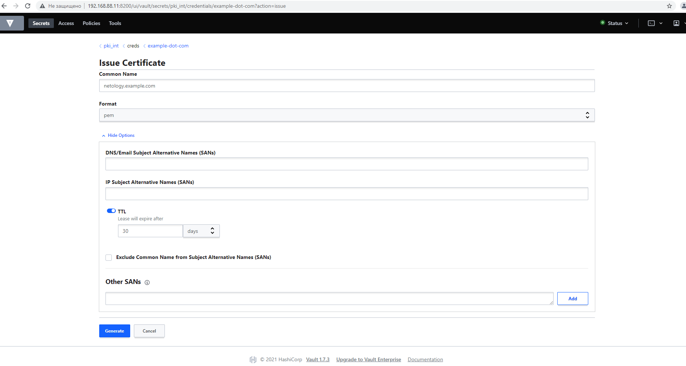

# Домашнее задание к занятию "3.9. Элементы безопасности информационных систем"

1. Установите [Hashicorp Vault](https://learn.hashicorp.com/vault) в виртуальной машине Vagrant/VirtualBox. Это не является обязательным для выполнения задания, но для лучшего понимания что происходит при выполнении команд (посмотреть результат в UI), можно по аналогии с netdata из прошлых лекций пробросить порт Vault на localhost:

    ```bash
    config.vm.network "forwarded_port", guest: 8200, host: 8200
    ```

    Однако, обратите внимание, что только-лишь проброса порта не будет достаточно – по-умолчанию Vault слушает на 127.0.0.1; добавьте к опциям запуска `-dev-listen-address="0.0.0.0:8200"`.
   > Решение. Установил.
1. Запустить Vault-сервер в dev-режиме (дополнив ключ `-dev` упомянутым выше `-dev-listen-address`, если хотите увидеть UI).
   > Решение. Запустил в PROD-режиме, создав файл настроек config.hcl:
   > ```bash
   > w-awank@w-awank-cl:~/vault$ cat config.hcl
   > ui = true
   > disable_mlock = true
   > 
   > storage "raft" {
   >   path    = "./vault/data"
   >   node_id = "node1"
   > }
   > 
   > listener "tcp" {
   >   address     = "0.0.0.0:8200"
   >   tls_disable = "true"
   > }
   > 
   > api_addr = "http://127.0.0.1:8200"
   > cluster_addr = "https://127.0.0.1:8201"
   > w-awank@w-awank-cl:~/vault$ vault server -config=config.hcl
   > ==> Vault server configuration:
   > 
   >              Api Address: http://127.0.0.1:8200
   >                      Cgo: disabled
   >          Cluster Address: https://127.0.0.1:8201
   >               Go Version: go1.15.13
   >               Listener 1: tcp (addr: "0.0.0.0:8200", cluster address: "0.0.0.0:8201", max_request_duration: "1m30s", max_request_size: "33554432", tls: "disabled")
   >                Log Level: info
   >                    Mlock: supported: true, enabled: false
   >            Recovery Mode: false
   >                  Storage: raft (HA available)
   >                  Version: Vault v1.7.3
   >              Version Sha: 5d517c864c8f10385bf65627891bc7ef55f5e827
   > 
   > ==> Vault server started! Log data will stream in below:
   > 
   > 2021-07-05T09:17:24.828Z [INFO]  proxy environment: http_proxy="" https_proxy="" no_proxy=""
   > ```
1. Используя [PKI Secrets Engine](https://www.vaultproject.io/docs/secrets/pki), создайте Root CA и Intermediate CA.
Обратите внимание на [дополнительные материалы](https://learn.hashicorp.com/tutorials/vault/pki-engine) по созданию CA в Vault, если с изначальной инструкцией возникнут сложности.
   > Решение. Делал все по [второй](https://learn.hashicorp.com/tutorials/vault/pki-engine) ссылке через WEB GUI.
   > 
   > Скрины GUI Root CA: 
   > 
   > Скрины GUI Intermediate CA 
   > 
   > 
   > Сами сертификаты в формате PEM: [CA_cert.pem](CA_cert.pem), [intermediate.cert.pem](intermediate.cert.pem)
   > 
1. Согласно этой же инструкции, подпишите Intermediate CA csr на сертификат для тестового домена (например, `netology.example.com` если действовали согласно инструкции).
   > Решение.
   > 
   > Сам сертификат с цепочкой и закрытым ключом в едином файле, генерируемом сервером vault: [netology.example.com.txt](netology.example.com.txt)
1. Поднимите на localhost nginx, сконфигурируйте default vhost для использования подписанного Vault Intermediate CA сертификата и выбранного вами домена. Сертификат из Vault подложить в nginx руками.
   > Решение. Файл [netology.example.com.wokey.pem](netology.example.com.wokey.pem) сформировал из netology.example.com.txt, вырезав из него private key и serial number. Файл [netology.example.com.key](netology.example.com.key) сформировал также, только вырезал все кроме private key.   
   > ```bash
   > w-awank@w-awank-cl:~/vault$ cat /etc/nginx/sites-available/default
   > ...
   > server {
   >         listen 80 default_server;
   >         listen [::]:80 default_server;
   > 
   >         # SSL configuration
   >         #
   >         listen 443 ssl default_server;
   >         listen [::]:443 ssl default_server;
   >         ssl_certificate /etc/nginx/netology.example.com.wokey.pem;
   >         ssl_certificate_key /etc/nginx/netology.example.com.key;
   > ...
   > root@w-awank-cl:/home/w-awank/vault# nginx -t
   > nginx: the configuration file /etc/nginx/nginx.conf syntax is ok
   > nginx: configuration file /etc/nginx/nginx.conf test is successful
   > root@w-awank-cl:/home/w-awank/vault# systemctl restart nginx
   > root@w-awank-cl:/home/w-awank/vault# systemctl status nginx
   > ● nginx.service - A high performance web server and a reverse proxy server
   >      Loaded: loaded (/lib/systemd/system/nginx.service; enabled; vendor preset: enabled)
   >      Active: active (running) since Sat 2021-07-10 08:59:00 UTC; 11s ago
   > ...
   > 
   > ```
1. Модифицировав `/etc/hosts` и [системный trust-store](http://manpages.ubuntu.com/manpages/focal/en/man8/update-ca-certificates.8.html), добейтесь безошибочной с точки зрения HTTPS работы curl на ваш тестовый домен (отдающийся с localhost). Рекомендуется добавлять в доверенные сертификаты Intermediate CA. Root CA добавить было бы правильнее, но тогда при конфигурации nginx потребуется включить в цепочку Intermediate, что выходит за рамки лекции. Так же, пожалуйста, не добавляйте в доверенные сам сертификат хоста.
   > Решение.
   > ```bash
   > root@w-awank-cl:/home/w-awank/vault# cat /etc/hosts | grep netology
   > 127.0.0.1 netology.example.com
   > w-awank@w-awank-cl:~/vault$ ll /usr/local/share/ca-certificates/
   > total 12
   > drwxr-xr-x 2 root root 4096 Jul  5 13:24 ./
   > drwxr-xr-x 5 root root 4096 Jul  5 12:34 ../
   > -rw-r--r-- 1 root root 1346 Jul  5 13:24 intermediate.cert.crt
   > w-awank@w-awank-cl:~/vault$ sudo update-ca-certificates
   > Updating certificates in /etc/ssl/certs...
   > 1 added, 0 removed; done.
   > Running hooks in /etc/ca-certificates/update.d...
   > done.
   > root@w-awank-cl:/home/w-awank/vault# curl -I https://netology.example.com
   > HTTP/1.1 200 OK
   > Server: nginx/1.18.0 (Ubuntu)
   > Date: Sat, 10 Jul 2021 09:12:14 GMT
   > Content-Type: text/html
   > Content-Length: 612
   > Last-Modified: Mon, 05 Jul 2021 12:34:25 GMT
   > Connection: keep-alive
   > ETag: "60e2fc51-264"
   > Accept-Ranges: bytes
   > ```
1. [Ознакомьтесь](https://letsencrypt.org/ru/docs/client-options/) с протоколом ACME и CA Let's encrypt. Если у вас есть во владении доменное имя с платным TLS-сертификатом, который возможно заменить на LE, или же без HTTPS вообще, попробуйте воспользоваться одним из предложенных клиентов, чтобы сделать веб-сайт безопасным (или перестать платить за коммерческий сертификат).
   > Решение. Ознакомился.

**Дополнительное задание вне зачета.** Вместо ручного подкладывания сертификата в nginx, воспользуйтесь [consul-template](https://medium.com/hashicorp-engineering/pki-as-a-service-with-hashicorp-vault-a8d075ece9a) для автоматического подтягивания сертификата из Vault.
