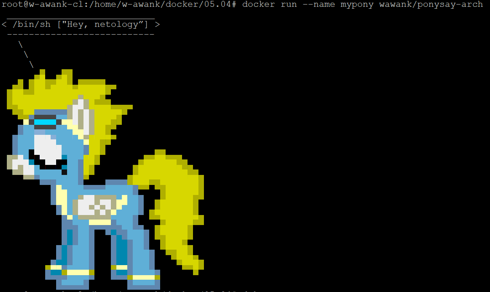

# Домашнее задание к занятию "5.4. Практические навыки работы с Docker"

## Задача 1 

В данном задании вы научитесь изменять существующие Dockerfile, адаптируя их под нужный инфраструктурный стек.

Измените базовый образ предложенного Dockerfile на Arch Linux c сохранением его функциональности.

```text
FROM ubuntu:latest

RUN apt-get update && \
    apt-get install -y software-properties-common && \
    add-apt-repository ppa:vincent-c/ponysay && \
    apt-get update
 
RUN apt-get install -y ponysay

ENTRYPOINT ["/usr/bin/ponysay"]
CMD ["Hey, netology”]
```

Для получения зачета, вам необходимо предоставить:
- Написанный вами Dockerfile
  > Решение.
  > ```text
  > FROM archlinux:latest
  >
  > RUN pacman -Sy && \
  > pacman -S ponysay --noconfirm
  > 
  > ENTRYPOINT ["/usr/bin/ponysay"]
  > CMD ["Hey, netology”]
  > ```
- Скриншот вывода командной строки после запуска контейнера из вашего базового образа
  > Решение. 
- Ссылку на образ в вашем хранилище docker-hub
  > Решение. https://hub.docker.com/repository/docker/wawank/ponysay-arch

## Задача 2 

В данной задаче вы составите несколько разных Dockerfile для проекта Jenkins, опубликуем образ в `dockerhub.io` и посмотрим логи этих контейнеров.

- Составьте 2 Dockerfile:

    - Общие моменты:
        - Образ должен запускать [Jenkins server](https://www.jenkins.io/download/)
        
    - Спецификация первого образа:
        - Базовый образ - [amazoncorreto](https://hub.docker.com/_/amazoncorretto)
        - Присвоить образу тэг `ver1` 
    
    - Спецификация второго образа:
        - Базовый образ - [ubuntu:latest](https://hub.docker.com/_/ubuntu)
        - Присвоить образу тэг `ver2` 

- Соберите 2 образа по полученным Dockerfile
- Запустите и проверьте их работоспособность
- Опубликуйте образы в своём dockerhub.io хранилище

Для получения зачета, вам необходимо предоставить:
- Наполнения 2х Dockerfile из задания
  > Решение. 
  > Докерфайл для Jenkins на Corretto:
  > ```text
  > FROM amazoncorretto:latest
  >
  > ADD https://get.jenkins.io/war-stable/latest/jenkins.war /root/
  > WORKDIR /root
  > EXPOSE 8080
  > ENTRYPOINT ["java"]
  > CMD ["-jar","jenkins.war"]
  > ```
  > Докерфайл для Jenkins на Ubuntu:
  > ```text
  > FROM ubuntu:latest
  > 
  > RUN apt-get update && \
  >     apt-get install -y openjdk-11-jdk
  > 
  > ADD https://get.jenkins.io/war-stable/latest/jenkins.war /root/
  > WORKDIR /root
  > EXPOSE 8080
  > ENTRYPOINT ["java"]
  > CMD ["-jar","jenkins.war"]
  > ``` 
- Скриншоты логов запущенных вами контейнеров (из командной строки)
  > Решение. Логи внутри контейнера для Jenkins на Corretto:
  > 
  > `# docker run --name myjenkins -p 8080:8080 -d wawank/jenkins-corretto:ver1`
  > 
  > `# docker logs --tail --follow 24c7c79e2918`
  > ```text
  > Running from: /root/jenkins.war 
  > webroot: $user.home/.jenkins
  > 2021-09-10 18:19:25.285+0000 [id=1]     INFO    org.eclipse.jetty.util.log.Log#initialized: Logging initialized @679ms to org.eclipse.jetty.util.log.JavaUtilLog
  > 2021-09-10 18:19:25.464+0000 [id=1]     INFO    winstone.Logger#logInternal: Beginning extraction from war file
  > 2021-09-10 18:19:27.086+0000 [id=1]     WARNING o.e.j.s.handler.ContextHandler#setContextPath: Empty contextPath
  > 2021-09-10 18:19:27.201+0000 [id=1]     INFO    org.eclipse.jetty.server.Server#doStart: jetty-9.4.42.v20210604; built: 2021-06-04T17:33:38.939Z; git: 5cd5e6d2375eeab146813b0de9f19eda6ab6e6cb; jvm 1.8.0_302-b08
  > 2021-09-10 18:19:27.620+0000 [id=1]     INFO    o.e.j.w.StandardDescriptorProcessor#visitServlet: NO JSP Support for /, did not find org.eclipse.jetty.jsp.JettyJspServlet
  > 2021-09-10 18:19:27.718+0000 [id=1]     INFO    o.e.j.s.s.DefaultSessionIdManager#doStart: DefaultSessionIdManager workerName=node0
  > 2021-09-10 18:19:27.718+0000 [id=1]     INFO    o.e.j.s.s.DefaultSessionIdManager#doStart: No SessionScavenger set, using defaults
  > 2021-09-10 18:19:27.720+0000 [id=1]     INFO    o.e.j.server.session.HouseKeeper#startScavenging: node0 Scavenging every 660000ms
  > 2021-09-10 18:19:28.412+0000 [id=1]     INFO    hudson.WebAppMain#contextInitialized: Jenkins home directory: /root/.jenkins found at: $user.home/.jenkins
  > 2021-09-10 18:19:28.644+0000 [id=1]     INFO    o.e.j.s.handler.ContextHandler#doStart: Started w.@b93aad{Jenkins v2.303.1,/,file:///root/.jenkins/war/,AVAILABLE}{/root/.jenkins/war}
  > 2021-09-10 18:19:28.676+0000 [id=1]     INFO    o.e.j.server.AbstractConnector#doStart: Started ServerConnector@5a5a729f{HTTP/1.1, (http/1.1)}{0.0.0.0:8080}
  > 2021-09-10 18:19:28.677+0000 [id=1]     INFO    org.eclipse.jetty.server.Server#doStart: Started @4071ms
  > 2021-09-10 18:19:28.685+0000 [id=21]    INFO    winstone.Logger#logInternal: Winstone Servlet Engine running: controlPort=disabled
  > 2021-09-10 18:19:30.298+0000 [id=26]    INFO    jenkins.InitReactorRunner$1#onAttained: Started initialization
  > 2021-09-10 18:19:30.344+0000 [id=27]    INFO    jenkins.InitReactorRunner$1#onAttained: Listed all plugins
  > 2021-09-10 18:19:32.536+0000 [id=27]    INFO    jenkins.InitReactorRunner$1#onAttained: Prepared all plugins
  > 2021-09-10 18:19:32.543+0000 [id=27]    INFO    jenkins.InitReactorRunner$1#onAttained: Started all plugins
  > 2021-09-10 18:19:32.582+0000 [id=27]    INFO    jenkins.InitReactorRunner$1#onAttained: Augmented all extensions
  > 2021-09-10 18:19:34.702+0000 [id=27]    INFO    jenkins.InitReactorRunner$1#onAttained: System config loaded
  > 2021-09-10 18:19:34.702+0000 [id=27]    INFO    jenkins.InitReactorRunner$1#onAttained: System config adapted
  > 2021-09-10 18:19:34.702+0000 [id=27]    INFO    jenkins.InitReactorRunner$1#onAttained: Loaded all jobs
  > 2021-09-10 18:19:34.703+0000 [id=27]    INFO    jenkins.InitReactorRunner$1#onAttained: Configuration for all jobs updated
  > 2021-09-10 18:19:34.811+0000 [id=40]    INFO    hudson.model.AsyncPeriodicWork#lambda$doRun$0: Started Download metadata
  > 2021-09-10 18:19:34.817+0000 [id=40]    INFO    hudson.util.Retrier#start: Attempt #1 to do the action check updates server
  > 2021-09-10 18:19:35.629+0000 [id=26]    INFO    jenkins.install.SetupWizard#init:
  > 
  > *************************************************************
  > *************************************************************
  > *************************************************************
  > 
  > Jenkins initial setup is required. An admin user has been created and a password generated.
  > Please use the following password to proceed to installation:
  > 
  > 2d161b01585f407c990799bb9093b0e2
  > 
  > This may also be found at: /root/.jenkins/secrets/initialAdminPassword
  > 
  > *************************************************************
  > *************************************************************
  > *************************************************************
  > 
  > 2021-09-10 18:20:11.819+0000 [id=27]    INFO    jenkins.InitReactorRunner$1#onAttained: Completed initialization
  > 2021-09-10 18:20:11.843+0000 [id=20]    INFO    hudson.WebAppMain$3#run: Jenkins is fully up and running
  > 2021-09-10 18:20:17.076+0000 [id=40]    INFO    h.m.DownloadService$Downloadable#load: Obtained the updated data file for hudson.tasks.Maven.MavenInstaller
  > 2021-09-10 18:20:17.077+0000 [id=40]    INFO    hudson.util.Retrier#start: Performed the action check updates server successfully at the attempt #1
  > 2021-09-10 18:20:17.086+0000 [id=40]    INFO    hudson.model.AsyncPeriodicWork#lambda$doRun$0: Finished Download metadata. 42,272 ms
  > ```
  > Логи внутри контейнера для Jenkins на Ubuntu:
  > 
  > `# docker run --name myjenkinsubu -p 8080:8080 -d wawank/jenkins-ubuntu:ver2`
  > 
  > `# docker logs --tail --follow 4182d46670f0`
  > ```text
  > Running from: /root/jenkins.war
  > webroot: $user.home/.jenkins
  > 2021-09-10 20:39:44.694+0000 [id=1]     INFO    org.eclipse.jetty.util.log.Log#initialized: Logging initialized @1519ms to org.eclipse.jetty.util.log.JavaUtilLog
  > 2021-09-10 20:39:44.874+0000 [id=1]     INFO    winstone.Logger#logInternal: Beginning extraction from war file
  > 2021-09-10 20:39:46.501+0000 [id=1]     WARNING o.e.j.s.handler.ContextHandler#setContextPath: Empty contextPath
  > 2021-09-10 20:39:46.635+0000 [id=1]     INFO    org.eclipse.jetty.server.Server#doStart: jetty-9.4.42.v20210604; built: 2021-06-04T17:33:38.939Z; git: 5cd5e6d2375eeab146813b0de9f19eda6ab6e6cb; jvm 11.0.11+9-Ubuntu-0ubuntu2.20.04
  > 2021-09-10 20:39:47.357+0000 [id=1]     INFO    o.e.j.w.StandardDescriptorProcessor#visitServlet: NO JSP Support for /, did not find org.eclipse.jetty.jsp.JettyJspServlet
  > 2021-09-10 20:39:47.464+0000 [id=1]     INFO    o.e.j.s.s.DefaultSessionIdManager#doStart: DefaultSessionIdManager workerName=node0
  > 2021-09-10 20:39:47.470+0000 [id=1]     INFO    o.e.j.s.s.DefaultSessionIdManager#doStart: No SessionScavenger set, using defaults
  > 2021-09-10 20:39:47.472+0000 [id=1]     INFO    o.e.j.server.session.HouseKeeper#startScavenging: node0 Scavenging every 600000ms
  > 2021-09-10 20:39:48.458+0000 [id=1]     INFO    hudson.WebAppMain#contextInitialized: Jenkins home directory: /root/.jenkins found at: $user.home/.jenkins
  > 2021-09-10 20:39:49.068+0000 [id=1]     INFO    o.e.j.s.handler.ContextHandler#doStart: Started w.@6eb82908{Jenkins v2.303.1,/,file:///root/.jenkins/war/,AVAILABLE}{/root/.jenkins/war}
  > 2021-09-10 20:39:49.147+0000 [id=1]     INFO    o.e.j.server.AbstractConnector#doStart: Started ServerConnector@30e868be{HTTP/1.1, (http/1.1)}{0.0.0.0:8080}
  > 2021-09-10 20:39:49.150+0000 [id=1]     INFO    org.eclipse.jetty.server.Server#doStart: Started @5979ms
  > 2021-09-10 20:39:49.154+0000 [id=23]    INFO    winstone.Logger#logInternal: Winstone Servlet Engine running: controlPort=disabled
  > 2021-09-10 20:39:49.712+0000 [id=29]    INFO    jenkins.InitReactorRunner$1#onAttained: Started initialization
  > 2021-09-10 20:39:49.759+0000 [id=29]    INFO    jenkins.InitReactorRunner$1#onAttained: Listed all plugins
  > WARNING: An illegal reflective access operation has occurred
  > WARNING: Illegal reflective access by com.google.inject.internal.cglib.core.$ReflectUtils$2 (file:/root/.jenkins/war/WEB-INF/lib/guice-4.0.jar) to method java.lang.ClassLoader.defineClass(java.lang.String,byte[],int,int,java.security.ProtectionDomain)
  > WARNING: Please consider reporting this to the maintainers of com.google.inject.internal.cglib.core.$ReflectUtils$2
  > WARNING: Use --illegal-access=warn to enable warnings of further illegal reflective access operations
  > WARNING: All illegal access operations will be denied in a future release
  > 2021-09-10 20:39:52.223+0000 [id=29]    INFO    jenkins.InitReactorRunner$1#onAttained: Prepared all plugins
  > 2021-09-10 20:39:52.233+0000 [id=28]    INFO    jenkins.InitReactorRunner$1#onAttained: Started all plugins
  > 2021-09-10 20:39:52.287+0000 [id=29]    INFO    jenkins.InitReactorRunner$1#onAttained: Augmented all extensions
  > 2021-09-10 20:39:54.445+0000 [id=28]    INFO    jenkins.InitReactorRunner$1#onAttained: System config loaded
  > 2021-09-10 20:39:54.446+0000 [id=28]    INFO    jenkins.InitReactorRunner$1#onAttained: System config adapted
  > 2021-09-10 20:39:54.447+0000 [id=28]    INFO    jenkins.InitReactorRunner$1#onAttained: Loaded all jobs
  > 2021-09-10 20:39:54.448+0000 [id=28]    INFO    jenkins.InitReactorRunner$1#onAttained: Configuration for all jobs updated
  > 2021-09-10 20:39:55.304+0000 [id=42]    INFO    hudson.model.AsyncPeriodicWork#lambda$doRun$0: Started Download metadata
  > 2021-09-10 20:39:55.335+0000 [id=42]    INFO    hudson.util.Retrier#start: Attempt #1 to do the action check updates server
  > 2021-09-10 20:39:55.507+0000 [id=29]    INFO    jenkins.install.SetupWizard#init:
  > 
  > *************************************************************
  > *************************************************************
  > *************************************************************
  > 
  > Jenkins initial setup is required. An admin user has been created and a password generated.
  > Please use the following password to proceed to installation:
  > 
  > 93e4f2e8d9eb411c8585dd63692dba92
  > 
  > This may also be found at: /root/.jenkins/secrets/initialAdminPassword
  > 
  > *************************************************************
  > *************************************************************
  > *************************************************************
  > ```
- Скриншоты веб-интерфейса Jenkins запущенных вами контейнеров (достаточно 1 скриншота на контейнер)
  > Решение.
  > 
  > Скрин1 веб-интерфейса Jenkins на Corretto:
  > 
  > Скрин2 веб-интерфейса Jenkins на Corretto после ввода пароля из файла контейнера:
  > 
  > Скрин3 веб-интерфейса Jenkins на Corretto после пропуска установки плагинов:
  > 
  > 
  > Скрины веб-интерфейса Jenkins на Ubuntu такие же.  
  
- Ссылки на образы в вашем хранилище docker-hub
  > Решение
  > 
  > https://hub.docker.com/r/wawank/jenkins-corretto/tags?page=1&ordering=last_updated
  > https://hub.docker.com/r/wawank/jenkins-ubuntu/tags?page=1&ordering=last_updated

## Задача 3 

В данном задании вы научитесь:
- объединять контейнеры в единую сеть
- исполнять команды "изнутри" контейнера

Для выполнения задания вам нужно:
- Написать Dockerfile: 
    - Использовать образ https://hub.docker.com/_/node как базовый
    - Установить необходимые зависимые библиотеки для запуска npm приложения https://github.com/simplicitesoftware/nodejs-demo
    - Выставить у приложения (и контейнера) порт 3000 для прослушки входящих запросов  
    - Соберите образ и запустите контейнер в фоновом режиме с публикацией порта

- Запустить второй контейнер из образа ubuntu:latest 
- Создайть `docker network` и добавьте в нее оба запущенных контейнера
- Используя `docker exec` запустить командную строку контейнера `ubuntu` в интерактивном режиме
- Используя утилиту `curl` вызвать путь `/` контейнера с npm приложением  

Для получения зачета, вам необходимо предоставить:
- Наполнение Dockerfile с npm приложением
  > Решение
  > ```text
  > FROM node:latest
  >
  > RUN wget -P /usr/app https://github.com/simplicitesoftware/nodejs-demo/archive/refs/heads/master.zip && \
  >  cd /usr/app && \
  >  unzip master.zip
  > 
  > WORKDIR /usr/app/nodejs-demo-master
  > RUN sed 's/localhost/0.0.0.0/g' app.js | tee app2.js && \
  >         rm app.js && \
  >         mv app2.js app.js && \
  >         npm install
  > EXPOSE 3000
  > ENTRYPOINT ["npm"]
  > CMD ["start"]
  > ```
- Скриншот вывода вызова команды списка docker сетей (docker network cli)
  > Решение.
  > ```bash
  > # docker network ls
  > NETWORK ID     NAME      DRIVER    SCOPE
  > 9135023a719f   LAN       bridge    local
  > 7b3d56033fb1   bridge    bridge    local
  > 9bd32e6bb6de   host      host      local
  > 852d2dcef111   none      null      local
  > ```

- Скриншот вызова утилиты curl с успешным ответом
  > Решение.
  > ```bash
  > # docker exec -ti myubuntu bash
  > root@19800654bd79:/# curl -I mynode:3000/
  > HTTP/1.1 200 OK
  > Cache-Control: private, no-cache, no-store, no-transform, must-revalidate
  > Expires: -1
  > Pragma: no-cache
  > Content-Type: text/html; charset=utf-8
  > Content-Length: 526208
  > ETag: W/"80780-ACITPAyDVWqGLWfjYCNr7hij72Y"
  > Date: Sat, 11 Sep 2021 08:04:50 GMT
  > Connection: keep-alive
  > Keep-Alive: timeout=5
  > ```
